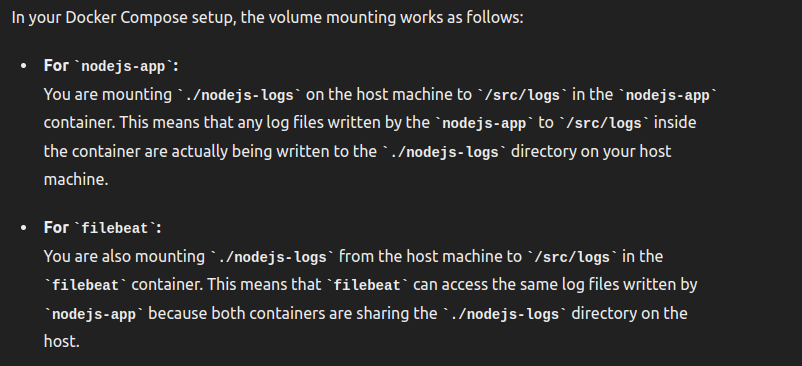
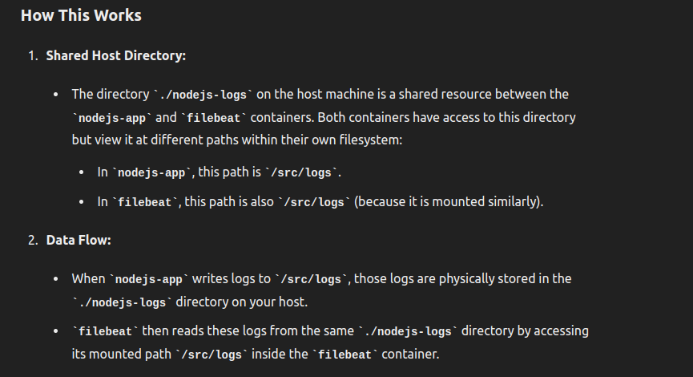
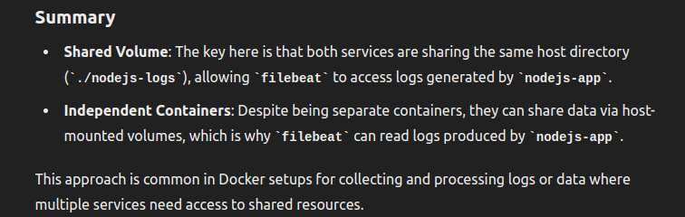

https://chatgpt.com/c/4e4afbb0-ae0f-4df6-88d0-5c26c9498b7c

__________________________________________________________________________________

docker-compose ...
```
  nodejs-app:
    build:
      context: ./nodejs-app 
      dockerfile: Dockerfile
    container_name: nodejs-app
    ports:
      - "8080:8080"
    depends_on:
      - elasticsearch
    volumes:
        - ./nodejs-logs:/src/logs
```

filebeat.yml...
```
filebeat.inputs:
- type: log
  scan_frequency: 1s
  enabled: true
  paths:
    - /src/logs/*.log  # For nodejs-app logs
  fields:
    service: nodejs-app
  fields_under_root: true
  json:
    keys_under_root: true
    overwrite_keys: true
    message_key: 'message'
```







